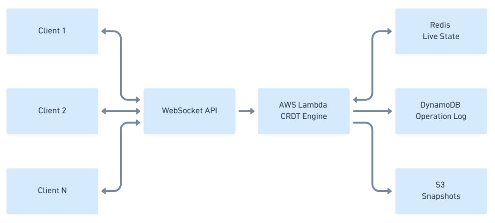

# 🚀 Real-Time Collaborative Editing Engine (AWS-Native)

A cloud-native, distributed real-time collaborative text editing system built using AWS WebSocket API, Lambda, DynamoDB, Upstash Redis, S3, and a custom Conflict-Free Replicated Data Type (CRDT) implementation.

This system enables multiple users to edit the same document simultaneously with strong convergence guarantees, low latency, and fault tolerance — without using locks or centralized coordination.

---

## Overview

Traditional collaborative systems rely on operational transforms or centralized coordination. This project implements a CRDT-based approach, allowing operations to be applied in any order while ensuring all replicas converge to the same final state.

The system is designed to be:

- Horizontally scalable  
- Eventually consistent  
- Fault tolerant  
- Stateless at the compute layer  
- Durable at the storage layer  

---

## System Architecture




### Component Responsibilities

**API Gateway (WebSocket)**  
- Manages persistent connections  
- Routes messages based on action type  

**AWS Lambda**  
- Processes JOIN_DOC, SEND_OP, SYNC_STATE events  
- Applies CRDT logic  
- Maintains stateless execution  

**Upstash Redis**  
- Stores active document state  
- Maintains connection-to-document mappings  
- Serverless Redis with global low-latency access 

**DynamoDB**  
- Stores immutable operation logs  
- Provides durable persistence  
- Enables replay for recovery  

**S3**  
- Stores periodic document snapshots  
- Reduces replay cost during recovery  

---

## Core Concepts

### Operation-Based Synchronization

Instead of syncing entire documents, the system synchronizes atomic operations:

```json
{
  "type": "insert",
  "id": "user-123-170000000",
  "char": "A",
  "left": "node-456"
}
